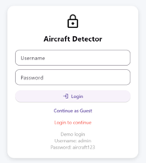
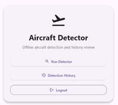
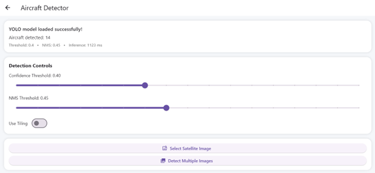
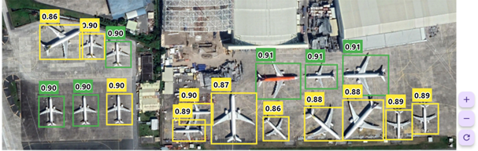
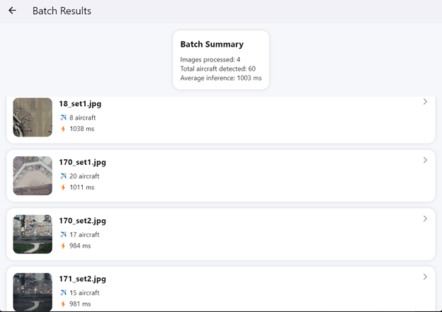
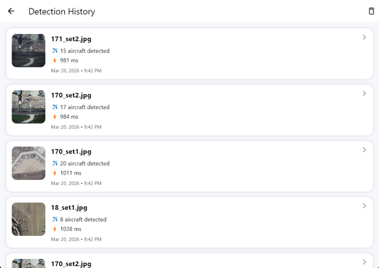

# ✈️ Aircraft Detector App

A Flutter-based mobile application that detects aircraft in satellite images using a YOLO model.

---

## 🚀 Features

- 🛰️ Detect aircraft from satellite images  
- 📸 Single image detection  
- 📂 Batch image detection  
- 📊 Detection history with saved results  
- ⚡ Fast inference using YOLO  
- 🔍 Zoom and inspect detection results  
- 🧠 Adjustable confidence & NMS thresholds  

---

## 🛠️ Tech Stack

- Flutter (UI)  
- Dart  
- YOLO (ONNX model)  
- Local storage (SharedPreferences)  

---

## 📱 Screens

- Login / Guest mode  
- Detector screen  
- Batch results screen  
- Detection history  

---

## 📸 Screenshots

### 🔐 Login


---

### 🏠 Home


---

### ⚙️ Detection Controls


---

### ✈️ Aircraft Detection (YOLO + Interactive Zoom)


---

### 📊 Batch Results


---

### 🕘 Detection History


---

## ⚙️ How to Run

```bash
flutter pub get
flutter run


## 📂 Project Structure

- `lib/screens/` → UI screens (home, detector, history)
- `lib/widgets/` → reusable UI components
- `lib/services/` → business logic & detection handling
- `assets/yolo11l-best.onnx` → YOLO model file

---

## 🧠 Model

- YOLO-based object detection
- Optimized for aircraft detection in aerial/satellite imagery

---

## 👨‍💻 Author

- Puvvanrao

---

## ⭐ Notes

- This project was developed as part of an aircraft detection system using deep learning and mobile deployment.